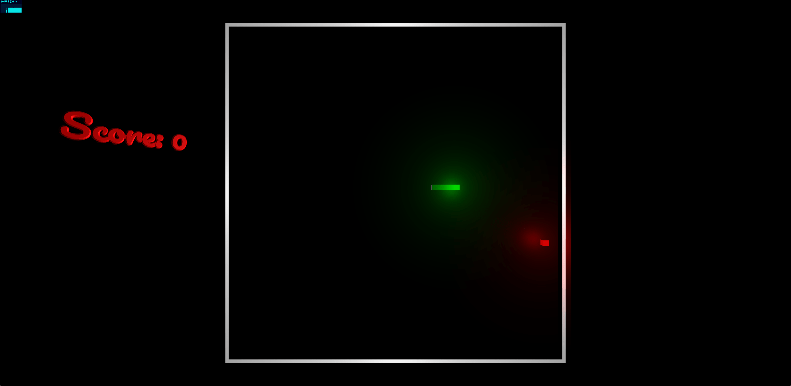

# SnakeGame in THREE.js

## Description
This is a simple snake game made using THREE.js. The game is made using the basic concepts of THREE.js
it uses 3D rendering, meshes, lighting, and shadows to create a 3D snake game.

## How to run the game
go to : https://abouabra.github.io/SnakeGame-ThreeJS/

## How to play the game
- Use the arrow keys to move the snake
- Eat the food to grow the snake
- Avoid hitting the walls and the snake itself

**Note:** you can move / rotate / scale the camera using the mouse buttons.

## How to run the game locally
- Clone the repository
- Run the index.html file in your browser

## Final thoughts
If you have any suggestions or feedback, please feel free to open an issue or submit a pull request.